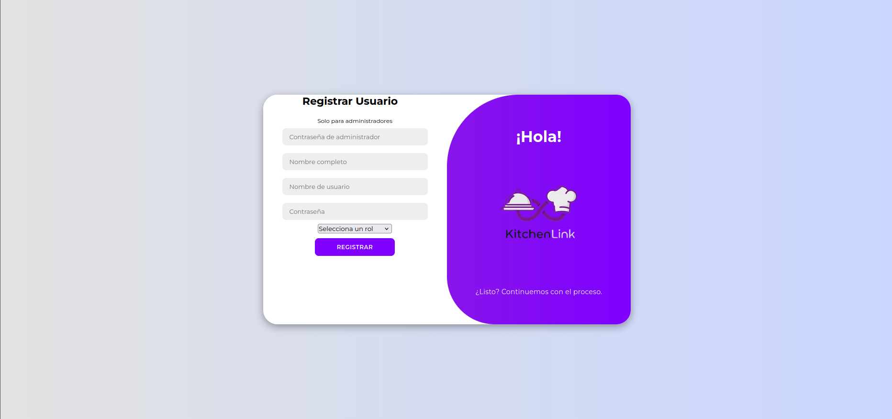

# KitchenLink 🍽️

**KitchenLink** es un sistema web para la gestión integral de restaurantes, diseñado para optimizar el manejo de **reservaciones**, **listas de espera**, **mesas** y **órdenes** en tiempo real.  

Actualmente el sistema **ya está desplegado y en funcionamiento** en la siguiente dirección:

🔗 [KitchenLink — Sistema en línea](https://kitchenlink.host.adellya.my.id/KitchenLink/index.php)

> Para acceder, puedes crear un usuario desde la sección **“Registrar”**.  
> ⚠️ **Nota:** Para registrar un nuevo usuario, se requiere la **contraseña de un gerente**.  

---

## ✨ Características principales

### Gestión de reservaciones
- 📅 **Creación de reservaciones:** Registra nuevas reservaciones con fecha, hora, número de personas y nombre del cliente.  
- 🪑 **Asignación visual de mesas:** Selecciona mesas disponibles desde una interfaz interactiva.  
- 👀 **Estado en tiempo real:** Visualiza las mesas disponibles, ocupadas o reservadas.  
- 📋 **Listado del día:** Consulta todas las reservaciones activas según la fecha.  
- ✅ **Historial:** Guarda reservaciones confirmadas o canceladas para consulta posterior.

### Gestión de lista de espera
- 👥 **Lista dinámica:** Añade clientes sin reservación a una lista activa.  
- ⏱️ **Tiempos estimados:** Calcula automáticamente los tiempos de espera.  
- 🪑 **Asignación directa:** Permite sentar clientes de la lista a mesas disponibles.  
- ❌ **Cancelaciones:** Envía al historial a los clientes que decidan no esperar.

### Administración y autenticación
- 🔒 **Inicio de sesión seguro:** Autenticación mediante contraseñas encriptadas con `password_hash()` en PHP.  
- 🧩 **Validación estricta:** Control del formato de datos (nombres, teléfonos, horarios, etc.).  
- 👨‍💼 **Roles:** Diferenciación entre **usuarios**, con permisos independientes.

---

## 🍽️ Orders — Interfaz de Mesero (YA DISPONIBLE)

La interfaz **Orders** permite a los **meseros** gestionar sus mesas y órdenes activas.  
Actualmente ya se encuentra **totalmente implementada y funcional**, con comunicación en tiempo real entre **meseros**, **cocina** y **barra**.

### Funcionalidades

#### 🪑 Interfaz principal
- Permite **crear mesas nuevas**, mostrando el **tiempo en minutos** desde su creación y el **número de personas**.  
- Incluye una **opción para editar mesa**, donde el mesero puede:
  - Agregar platillos y **dividirlos por tiempos** (según se requiera).  
  - **Agregar comentarios** individuales a los productos.  
  - Usar una **barra de búsqueda** para localizar productos fácilmente (organizados por categorías).  
  - **Agregar múltiples unidades** de un producto a la vez.  
  - **Enviar la orden a cocina y/o barra**, regresando automáticamente a la vista principal.

#### ⚙️ Opciones avanzadas de mesa
Desde la selección de una mesa activa, el mesero puede:
- 🔢 **Cambiar número de mesa** o **cantidad de personas**.  
- 🔁 **Mover productos entre mesas**.  
- ❌ **Cancelar productos** individuales.  
- 👨‍🍳 **Reasignar el mesero** responsable de una mesa.  

#### ⏳ Ordenes pendientes
- Nueva **interfaz dinámica** donde cada mesero visualiza sus órdenes pendientes en tiempo real.  
- Cada producto cambia automáticamente de estado según el progreso en cocina o barra (**Pendiente → Preparando → Listo**).  
- Muestra el **tiempo en minutos desde que la orden fue enviada**.  
- Cuando una orden está completamente lista y el mesero la entrega, puede presionar **“Completar orden”**, eliminándola de su lista.  

---

## 👨‍🍳 Interfaz de Cocina (YA DISPONIBLE)

- Muestra todas las órdenes enviadas por los meseros en **tiempo real**, incluyendo:
  - Nombre del mesero que la envió.  
  - Hora exacta de envío y **minutos transcurridos** desde entonces.  
  - Detalle completo de la orden (tiempos, productos y comentarios).  
- Cada producto puede marcarse con un clic:
  - 🕐 **Pendiente → Preparando → Listo**
- Cuando todos los productos están listos, la orden completa pasa automáticamente al **historial de cocina**.  

### 🧾 Historial de Cocina (YA DISPONIBLE)
- Permite **consultar órdenes completadas por fecha**.  
- Visualiza todos los productos procesados ese día junto con su hora y mesero correspondiente.  

---

## 🍹 Interfaz de Barra (YA DISPONIBLE)

La interfaz de barra funciona de forma análoga a la de cocina, pero únicamente muestra **productos pertenecientes a la barra**.  
- Gestiona el estado de cada bebida en tiempo real (**Pendiente → Preparando → Listo**).  
- Cuando todas las bebidas de una orden están listas, se envía al **historial de barra**, con las mismas opciones de filtrado por fecha.  

---

## 🍹👨‍🍳⏳ Comunicacion en tiempo real entre meseros con cocina y barra (YA DISPONIBLE)

En la interfaz de barra y cocina al momento de poner productos como listos en la pantalla principal de los meseros **Se muestra una notificacion por platillo o bebida segun vayan estando listos**.  
- Por que no fue suficiente con solo verlo en la pantalla de ordenes pendientes, es aun mas intuitivo poderlo seguir viendo ahi y ademas ver una notificacion 
estetica en la pantalla principal de meseros.

---

## ⏳ Interfaz principal de caja ya disponible (YA DISPONIBLE)

Interfaz principal de caja con opciones como
- Imprimir preticket
  - Al imprimir un ticket la mesa pasa a estar como bloqueada, en la interfaz del mesero cambia esteticamente y permite seguir accediendo al tpv de la mesa pero sin dejar ingresar mas productos.
  - Si el mesero sigue en el tpv de la mesa cuando se bloquee la mesa, y el mesero intenta agregar mas productos y mandar una nueva orden el sistema lo bloquea avisando que la mesa ya solicito el ticket. 
- Permite agregar descuentos ya sea en decimal o en porcentajes.
- Al cobrar la cuenta permite varios metodos de pago, calculando el cambio en caso de que sean pagos en efectivo, calcular propina en caso de que se deje en tarjeta.
- Finalmente al terminar el cobro la mesa se borra todo de las tablas principales y se mandan a tablas de historial para futuros reportes y por ultimo genera el ticket final. 

## 🛠️ Tecnologías utilizadas

- **Frontend:** `HTML5`, `CSS3`, `JavaScript (Vanilla)`  
- **Backend:** `PHP`  
- **Base de datos:** `MySQL`  
- **Servidor requerido:** Hosting o servidor con soporte para **PHP + MySQL**  
- **Compatibilidad:** Funciona en cualquier entorno con Apache, Nginx o similar.

---

## 🚀 Despliegue en servidor

Si deseas desplegar **KitchenLink** por tu cuenta, sigue estos pasos:

### 1. Requisitos
- Servidor web con soporte para:  
  - **PHP 7.4+ o superior**  
  - **MySQL 5.7+ o MariaDB**  
  - Archivos estáticos (`HTML`, `CSS`, `JS`)  
- Acceso a **phpMyAdmin** o consola MySQL para importar la base de datos.

> ⚠️ **Importante:** KitchenLink **no se ejecuta en local** (XAMPP/WAMP) por defecto; requiere un **servidor web real o hosting** compatible con PHP y MySQL.

### 2. Configuración de la base de datos
1. Crea una base de datos llamada `kitchenlink_db`.  
2. Importa el contenido del archivo `documentation/tables.txt` (estructura y datos base).

### 3. Configuración del proyecto
1. Sube la carpeta `KitchenLink` al directorio público de tu hosting (`public_html`, `htdocs`, etc.).  
2. Edita `KitchenLink/src/php/db_connection.php` con tus credenciales MySQL (usuario, contraseña y nombre de la BD).  
3. Accede desde tu navegador con la URL de tu dominio:  
[https://tusitio.com/KitchenLink/login.html](https://tusitio.com/KitchenLink/login.html)

---

## 📋 Notas importantes

### Creación de usuarios iniciales
Para registrar usuarios por primera vez (modo despliegue):  
1. Edita `KitchenLink/src/php/generar_hash.php` con la contraseña deseada.  
2. Ejecuta el archivo desde el navegador:  
[https://tusitio.com/KitchenLink/src/php/generar_hash.php](https://tusitio.com/KitchenLink/src/php/generar_hash.php)  
3. Copia el hash generado e insértalo manualmente en la base de datos junto con un nombre de usuario y rol.

### Registro de nuevos usuarios
- Página de registro:  
[https://tusitio.com/KitchenLink/register.php](https://tusitio.com/KitchenLink/register.html)  
- Ingresa nombre completo, usuario, contraseña y rol.  
- El sistema encripta la contraseña automáticamente.  
- 🔑 Se requiere la **contraseña de gerente** para crear nuevos usuarios.

---

  

---

## 📚 Documentación del proyecto

Toda la documentación técnica, manuales, diagramas y archivos complementarios se encuentran disponibles en la carpeta:  

`/documentation/docs/`  

Ahí se incluyen los archivos PDF correspondientes al desarrollo, configuración, estructura de la base de datos y guías de usuario. La documentación se irá ampliando conforme avanza el proyecto.

---

## 💬 Contacto y soporte

Si deseas probar el sistema, solicitar acceso o recibir ayuda para desplegarlo:  
📩 **DM a [@imalejovar](https://www.instagram.com/imalejovar)** en Instagram.

---

  

