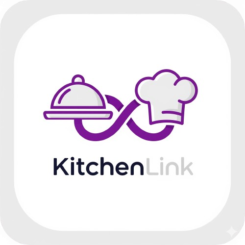

# KitchenLink 🍽️

  

**KitchenLink** es un **ERP transaccional en tiempo real** para la operación de restaurantes. Gestiona mesas, órdenes, cocina, barra, caja, usuarios, reservaciones, lista de espera, checador, perfil del mesero y control de mermas desde una sola plataforma.

## Arquitectura y seguridad

KitchenLink está pensado para operar con varios roles y alta concurrencia.

- **Sesión única:** si un usuario inicia sesión en otro dispositivo, la sesión anterior se invalida.
- **Protección anti-bots:** capa de seguridad en PHP para bloquear tráfico automatizado.
- **Row-level security:** los meseros solo operan sobre sus propias mesas.
- **Bloqueo de concurrencia:** evita que dos roles modifiquen la misma mesa al mismo tiempo.
- **Inventario 85/86:** el stock puede marcarse como disponible o agotado en tiempo real.

## Módulos principales

### Orders - Interfaz de mesero

La vista principal del mesero permite crear y administrar mesas activas en tiempo real.

- Crear mesas nuevas con tiempo transcurrido y número de personas.
- Editar mesas para agregar productos, comentarios y tiempos de servicio.
- Buscar productos rápidamente y agregar varias unidades de una vez.
- Enviar órdenes a cocina y/o barra.
- Mover productos, cancelar ítems y reasignar meseros desde opciones avanzadas.
- Consultar órdenes pendientes con estados **Pendiente → Preparando → Listo**.

### Perfil del mesero

Desde el bloque del usuario en la interfaz de mesas se abre un modal con el perfil operativo del mesero.

- Muestra métricas como propinas, venta total, cuentas cerradas, clientes atendidos, ticket promedio, mesas abiertas y hora de inicio de turno.
- El perfil se obtiene desde el módulo de órdenes y se presenta como una tarjeta flotante de consulta rápida.
- Sirve para dar contexto al servicio sin salir de la operación diaria.

### Cocina

- Visualización en tiempo real de todas las órdenes enviadas por meseros.
- Muestra hora de envío, tiempo transcurrido y detalle completo de la orden.
- Permite avanzar cada producto entre los estados operativos.
- Cuando una orden se completa, pasa automáticamente al historial de cocina.

### Barra

- Flujo equivalente al de cocina, pero filtrado solo para productos de barra.
- Estados en tiempo real para bebidas y pedidos de barra.
- Historial por fecha para consultar órdenes completadas.

### Caja / TPV

- Imprime pre-ticket y bloquea la mesa cuando corresponde.
- Permite aplicar descuentos, métodos de pago y cálculo automático de cambio o propina.
- Al cerrar la cuenta, la mesa se migra a historial para reportes y ticket final.

### Gestión de usuarios

- Altas, bajas, edición de datos y asignación de roles.
- Integración con reconocimiento facial para registrar y autenticar usuarios.
- Columna de rostro para visualizar quién ya tiene descriptor facial guardado.

### Gestión de mermas

El módulo de mermas permite registrar productos perdidos o desperdiciados directamente desde una cuenta activa.

- Selección de mesa con cuenta abierta.
- Registro de merma por motivo: caducado, error de cocina, error del mesero, dañado o derramado, entre otros.
- Captura de notas adicionales para auditoría.
- Reporte por rango de fechas para revisar mermas históricas.

### Reservaciones y lista de espera

- CRUD de reservaciones con validación de fecha, hora, PAX y datos del cliente.
- Vista de mesas ocupadas, libres o reservadas para evitar overbooking.
- Agenda del día e historial de reservaciones.
- Lista de espera para walk-ins con cálculo de tiempo estimado y asignación directa a mesa.

## Reconocimiento facial y checador

### Seguridad del modelo

- El matching sucede en el cliente con JavaScript y face-api.js.
- Al servidor solo se envía el `user_id` identificado, nunca imagen ni video.
- El descriptor facial se guarda en `TEXT` dentro de MySQL.
- El servidor crea la sesión PHP normal y redirige según el rol.

### Umbral de coincidencia

El umbral controla la sensibilidad del reconocimiento:

- **0.4** = muy estricto.
- **0.5** = equilibrado y recomendado.
- **0.6** = permisivo.

### Uso en tablets

- La cámara frontal funciona en Chrome y Safari en iOS y Android.
- El servidor debe servir por HTTPS para permitir `getUserMedia` en móviles.

### Flujo completo

1. El usuario abre `login.php`.
2. La cámara se activa automáticamente.
3. face-api.js detecta el rostro y calcula el descriptor.
4. Se compara contra los descriptores almacenados.
5. Tras coincidencias consecutivas suficientes, se autentica.
6. Si falla la cámara, se muestra el formulario tradicional de acceso.

### Checador

- Se accede desde `login.php` mediante el panel del checador.
- El módulo permite registrar **ENTRADA** o **SALIDA**.
- El historial puede filtrarse por empleado y fecha.
- Está pensado para una tablet fija y no requiere sesión iniciada.

## Tecnologías utilizadas

- **Frontend:** HTML5, CSS3 y JavaScript vanilla.
- **Backend:** PHP.
- **Base de datos:** MySQL.
- **Servidor:** compatible con PHP y MySQL en Apache, Nginx o similar.

## Despliegue

1. Crea la base de datos `kitchenlink_db`.
2. Importa `documentation/tables.txt`.
3. Configura `KitchenLink/src/php/db_connection.php` con tus credenciales.
4. Sube el proyecto al directorio público del hosting.
5. Abre `https://tusitio.com/KitchenLink/index.php`.

## Documentación

La documentación técnica y manuales se encuentran en `/documentation/docs/`.

## Soporte

Si deseas probar el sistema, solicitar acceso o recibir ayuda para desplegarlo, puedes escribir por Instagram a [@imalejovar](https://www.instagram.com/imalejovar).

  

